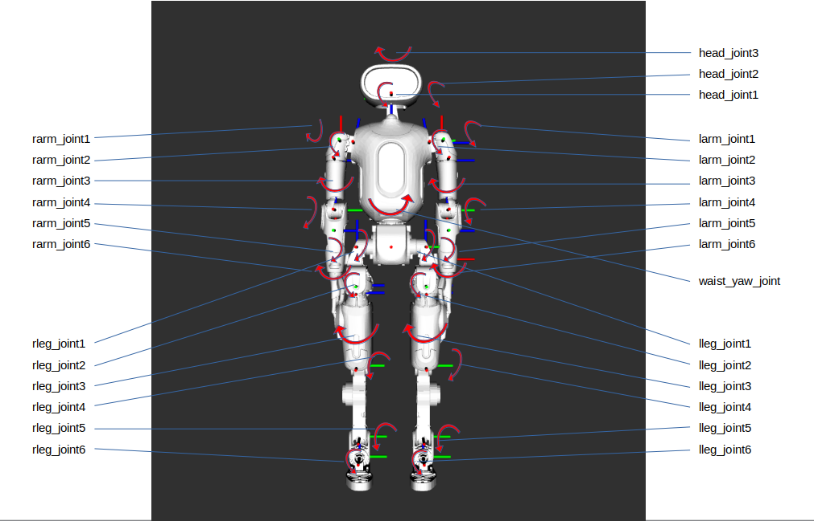

# orca_upper_body_example

## Description



## Install

- [LCM](https://lcm-proj.github.io/lcm/content/install-instructions.html)

## Structure

```text
.
├── cy_arm_controller_example               # example code for solving inverse kinematics 
│   ├── assets
│   │   └── picture01.png
│   ├── cy_arm_controller_example
│   │   ├── __init__.py
│   │   ├── left_example.py
│   │   └── right_example.py
│   ├── package.xml
│   ├── README.md
├── cy_robot_dynamics_example               # example code for identifying payload
│   ├── assets
│   │   └── picture01.png
│   ├── cy_robot_dynamics_example
│   │   ├── __init__.py
│   │   ├── left_example.py
│   │   └── right_example.py
│   ├── package.xml
│   ├── README.md
├── LICENSE     
├── motor_control                           # motor control example 
│   ├── controller2robot.py                 # example of sending commands to the robot from a controller
│   ├── lowlevel_sdk                        # definitions of LCM types for the robot
│   │   ├── cyan_armwaisthead_cmd_lcmt.py   
│   │   ├── cyan_armwaisthead_data_lcmt.py
│   │   └── __init__.py
│   ├── robot2controller.py                 # example of sending data from the robot to a controller
│   └── t_curve_planner.py                  # 
└── README.md
```

## cy_arm_controller_example

Example code for solving inverse kinematics

## cy_robot_dynamics_example

Example code for identifying payload

## motor_controller

Example code for sending and receiving upperbody joint-level commands to/from the robot.
