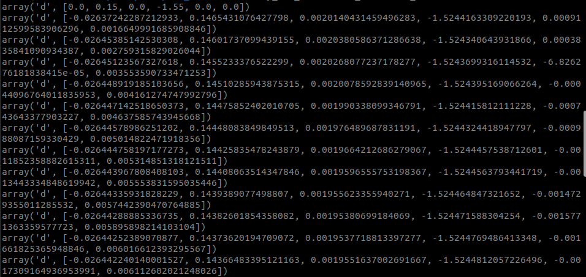

# cy_arm_controller_example

1. Enter the ROS2 workspace folder

```
cd ~/orca_app/ros2_ws/
```

2. Start the inverse_kinematics nodes

```
ros2 run cy_arm_controller left_inverse_kinematics # left hand
ros2 run cy_arm_controller right_inverse_kinematics # right hand
```

3. Start the example nodes

```
ros2 run cy_arm_controller_example left_example # left hand
ros2 run cy_arm_controller_example right_example # right hand
```

4. The following information is displayed in the terminal


