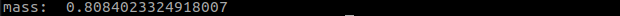

# cy_robot_dynamics_example

1. Start the dynamics node

```
ros2 launch cy_robot_dynamics robot_dynamics.launch.py
```

2. Start the example nodes

```
ros2 run cy_robot_dynamics_example left_example # left hand
ros2 run cy_robot_dynamics_example right_example # right hand
```

3. The following information is displayed in the terminal


